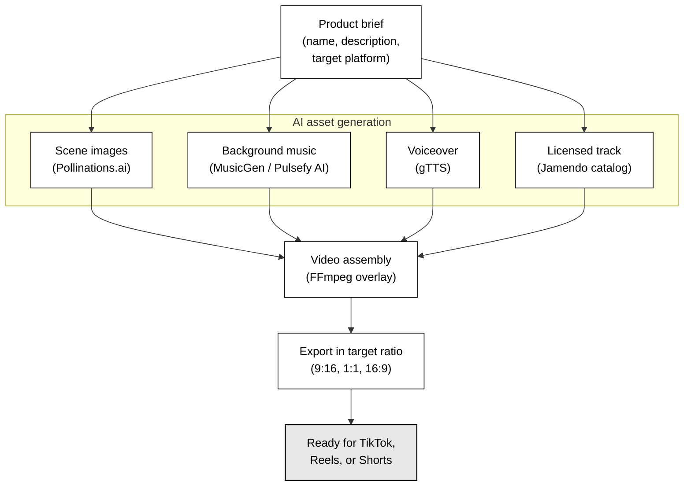

```mermaid
flowchart TD
    subgraph manual [MANUAL WORKFLOW — total ~8 hours across 4 separate tools]
        direction LR
        M1["0–2h<br/>Design product visuals<br/>in Canva or Figma"]
        M2["2–4h<br/>Generate or license<br/>music in Suno or<br/>stock-music site"]
        M3["4–5h<br/>Record voiceover<br/>or generate in<br/>ElevenLabs"]
        M4["5–8h<br/>Edit and assemble<br/>final ad in CapCut<br/>or Premiere"]
        M1 --> M2 --> M3 --> M4
    end

    subgraph ai [AI-ASSISTED WORKFLOW — Pulsefy, total ~10 minutes in one app]
        direction LR
        A1["0–3min<br/>Enter product brief"]
        A2["3–5min<br/>Generate scene<br/>images and pick<br/>variants"]
        A3["5–7min<br/>Generate music<br/>or pick from catalog;<br/>generate voiceover"]
        A4["7–10min<br/>Preview, assemble,<br/>and export"]
        A1 --> A2 --> A3 --> A4
    end

    classDef plain fill:#ffffff,stroke:#000000,stroke-width:1px,color:#000000
    class M1,M2,M3,M4,A1,A2,A3,A4 plain
```

# Chapter 1 — Figure specifications (ad-creation framing, 2026-05-07)

Two diagrams to draw for Chapter 1. Both are in Mermaid (paste into https://mermaid.live, export as PNG, insert into Word). Captions below each go centred under the figure in plain Times New Roman 10 pt.

The framing was pivoted on 2026-05-07 from music streaming to ad creation. Both figures had to be re-spec'd from scratch — the previous "Listening flow ↔ Creation flow" diagram does not apply.

---

## Figure 1 — Pulsefy ad creation pipeline overview

### Purpose

This is the load-bearing diagram of Chapter 1. The chapter argues that existing ad-creation tools fragment the production pipeline across four separate applications, and that Pulsefy unifies them. The figure has to make this visually obvious in one glance: *one product brief enters, four parallel asset generators run, the assets converge into one finished ad*.

### Mermaid code

### Why this shape

- **One node at the top (`Product brief`)** — Pulsefy's single entry point. The product description plus target platform configures every downstream step.
- **Four parallel asset boxes (Image / Music / Voiceover / Licensed track)** — these are Pulsefy's four generation subsystems plus the licensed-music alternative. They run in parallel, not sequentially. *Music* and *Licensed track* are mutually exclusive in practice (the user picks one) but both feed the same assembly stage, which is why both are shown.
- **Two convergence nodes (`Video assembly` then `Export`)** — the assembly fuses the chosen audio onto the visuals; the export step picks the social-platform aspect ratio.
- **Gray output box (`Ready for TikTok, Reels, or Shorts`)** — visually distinct so the reader sees the publish-ready endpoint.

The diagram's argument: a competitor needs four separate apps to produce the same output; Pulsefy collapses those into one branched pipeline.

### Caption (exact text)

`Figure 1: Pulsefy ad creation pipeline overview`

---

## Figure 2 — Manual versus AI-assisted ad creation timelines

### Purpose

Justifies the time-and-cost claim made in 1.3 and 1.4. The visual argument is: a creator using fragmented tooling spends hours per ad; the same creator using Pulsefy spends minutes. This must be **honest** — no exaggerated factor like "1000× faster". Hours-vs-minutes is the real claim.

### Mermaid code

### Why this shape

- **Two stacked horizontal subgraphs**, each labelled with its total duration in the subgraph title (`~8 hours` vs `~10 minutes`).
- **Four blocks per subgraph** so the visual real estate is roughly the same on the page despite the 48× duration difference. The reader is comparing *activities*, not pixel-widths, while the time labels keep the actual scale honest.
- **Time range baked into each block label** so durations are visible without distorting the layout. This avoids Mermaid's Gantt-chart problem where the AI workflow would render as a tiny invisible bar next to the manual one.
- **Manual workflow names four specific competitor tools** (Canva, Suno, ElevenLabs, CapCut) — this anchors the fragmentation argument in named products the reader recognises.
- **AI workflow names no tool other than Pulsefy** because the whole pipeline lives inside one app.

### Caption (exact text)

`Figure 2: Manual versus AI-assisted ad creation timelines`

---

## How to render and export

1. Go to https://mermaid.live
2. Paste the code from either figure into the editor.
3. Click **Actions → PNG (download)** for a transparent-background PNG.
4. In Word, replace the `[FIGURE N: ... — to be drawn]` placeholder with the inserted image (Insert → Pictures → From File).
5. Keep the existing `Figure N: <caption>` line beneath the inserted image — the caption styling is already correct.
6. After both figures are in, right-click the Table of Figures at the front of the document and choose **Update Field** to refresh it.

---

## Why these figures matter for the defense

Likely commissioner questions about Chapter 1 and how each figure answers them:

> *"Why couldn't a user just open Canva, Suno, ElevenLabs, and CapCut in four tabs? They're all free."*

Figure 1 answers this. The four-prong asset stage shows that each of those tools owns one column. The convergence point shows Pulsefy's contribution: a single assembly pipeline that ties all four asset types together with consistent format handling and a single account.

> *"How much faster is your AI workflow really? Hours-to-minutes is a strong claim."*

Figure 2 answers this honestly. ~8 hours of fragmented work versus ~10 minutes inside one app. The block contents make the comparison concrete: same four stages, different absolute cost. No invented multipliers.

Both figures are simple enough to walk through verbally during the defense. Practice naming the four tools listed in the manual workflow — the commissioner may ask which tool corresponds to which Pulsefy subsystem, and the right answer is *Canva → Pollinations imagegen, Suno → MusicGen, ElevenLabs → gTTS, CapCut → FFmpeg overlay*.
